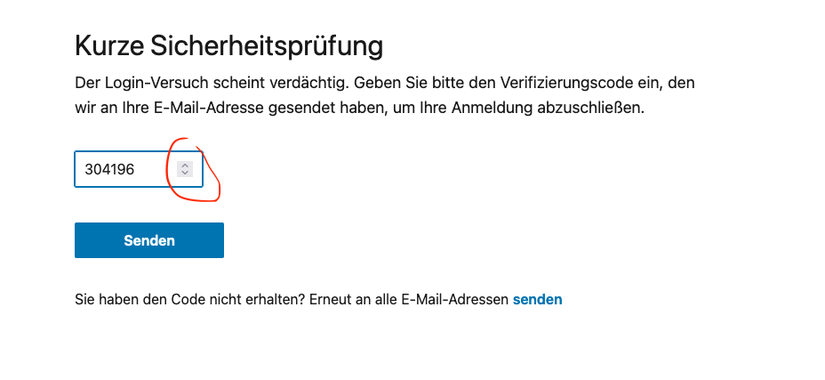
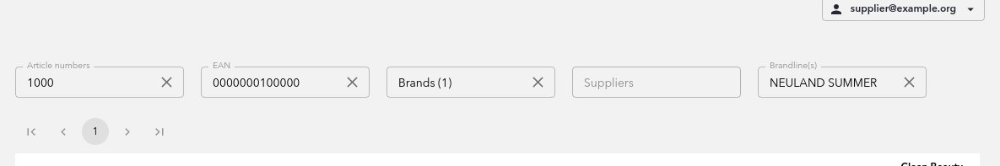
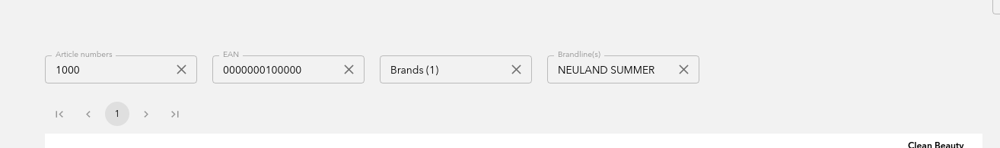

# UX (User Experience) An Beispielen

Die **UX-Gilde** von [neuland](https://www.neuland-bfi.de/) bietet euch hier Beispiele von guter 
und schlechter UX, wobei die Berwertung natürlich auch immer einen subjektiven Touch hat. Wir 
liefern aber die Begründungen dazu, warum etwas als gut oder schlecht bewertet werden kann.

## Fall von LinkedIn: Der nicht hilfreiche Spinner

Im folgenden Beispiel wird ein Spinner für eine hohe Zahl angeboten. Es macht nicht viel Sinn, bei 
vielstelligen Zahlen wie Telefonnummern, Postleitzahlen, Kreditnummer oder eben Verifikationsnummern 
einen Spinner anzubieten. Der Anwender würde ewig brauchen, um zur richtigen Zahl zu kommen.

Am schlimmsten wäre es noch, das Zahlenfeld nicht editierbar zu machen.

Es ist allerdings nicht perse schlecht, denn die Eingabe ist hier ja auch ohne Spinner möglich. Es 
verwirrt den Nutzer einfach nur kurz.

Ein Versuch zur Erklärung, warum es zu diesem seltsamen Feld im Screenshot überhaupt kommen konnte 
(ist nur eine Theorie): 
Ziel war es vielleicht, ein HTML-Feld zu nutzen, das bei Smartphones die Zahlentastatur 
öffnet (`inputmode="numeric"`). Aber im Desktop wird damit halt die Up-Down-Bedienelemente zur 
Verfügung gestellt.

#### Lösung:
Switches für verschiedene Browser Agenten (mobile vs Desktop) _[TODO: etwas mehr ausführen]_

## Fall: Dem Anwender schön aufzeigen, was man alles nicht darf

In einem unserer früheren Projekte für ein Backoffice Tool können Daten über bestimmte Kriterien 
gefiltert werden. Es gibt aber eine Gruppe von Anwendern, die niemals nach z.B. "Suppliern" filtern 
dürfen, und das sieht dann so aus:

Der "Supplier" Filter ist deaktiviert. Für den Anwender ist das natürlich doof: Er fragt sich, was 
das Feld soll, oder wann das mal aktiv wird. Für ihn wird das aufgrund fehlender Rechte allerdings 
niemals aktiv werden.

#### Lösung:
Um die Begehrlichkeiten von niemals zur Verfügung stehenden Features erst gar nicht zu wecken, kann 
man solche Elemente für diese Gruppe von Menschen einfach ausblenden.

Je weniger das Auge zu lesen und je weniger das Hirn auszublenden hat, desto angenehmer ist es
für den Anwender.
