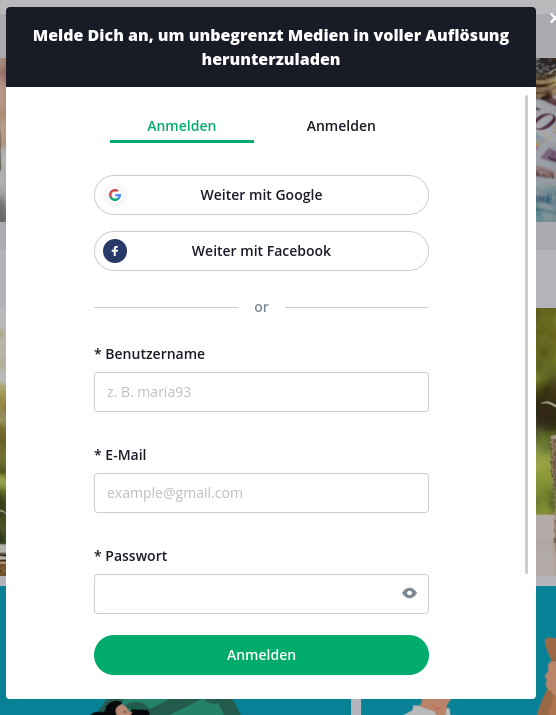
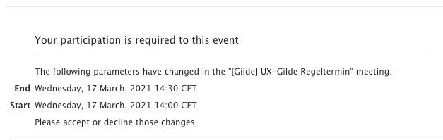

# UX (User Experience) An Beispielen

Die **UX-Gilde** von [neuland](https://www.neuland-bfi.de/) bietet euch hier Beispiele von guter 
und schlechter UX, wobei die Berwertung natürlich auch immer einen subjektiven Touch hat. Wir 
liefern aber die Begründungen dazu, warum etwas als gut oder schlecht bewertet werden kann.

## Fall von LinkedIn: Der nicht hilfreiche Spinner

Im folgenden Beispiel wird ein Spinner für eine hohe Zahl angeboten. Es macht nicht viel Sinn, bei 
vielstelligen Zahlen wie Telefonnummern, Postleitzahlen, Kreditnummer oder eben Verifikationsnummern 
einen Spinner anzubieten. Der Anwender würde ewig brauchen, um zur richtigen Zahl zu kommen.

Am schlimmsten wäre es noch, das Zahlenfeld nicht editierbar zu machen.

Es ist allerdings nicht perse schlecht, denn die Eingabe ist hier ja auch ohne Spinner möglich. Es 
verwirrt den Nutzer einfach nur kurz.

Ein Versuch zur Erklärung, warum es zu diesem seltsamen Feld im Screenshot überhaupt kommen konnte 
(ist nur eine Theorie): 
Ziel war es vielleicht, ein HTML-Feld zu nutzen, das bei Smartphones die Zahlentastatur 
öffnet (`inputmode="numeric"`). Aber im Desktop wird damit halt die Up-Down-Bedienelemente zur 
Verfügung gestellt.

#### Lösung:
Switches für verschiedene Browser Agenten (mobile vs Desktop) _[TODO: etwas mehr ausführen]_

## Fall: Dem Anwender schön aufzeigen, was man alles nicht darf

In einem unserer früheren Projekte für ein Backoffice Tool können Daten über bestimmte Kriterien 
gefiltert werden. Es gibt aber eine Gruppe von Anwendern, die niemals nach z.B. "Suppliern" filtern 
dürfen, und das sieht dann so aus:

Der "Supplier" Filter ist deaktiviert. Für den Anwender ist das natürlich doof: Er fragt sich, was 
das Feld soll, oder wann das mal aktiv wird. Für ihn wird das aufgrund fehlender Rechte allerdings 
niemals aktiv werden.

#### Lösung:
Um die Begehrlichkeiten von niemals zur Verfügung stehenden Features erst gar nicht zu wecken, kann 
man solche Elemente für diese Gruppe von Menschen einfach ausblenden.

Je weniger das Auge zu lesen und je weniger das Hirn auszublenden hat, desto angenehmer ist es
für den Anwender.

### Fall: Nicht hilfreiche Fehlermeldungen ausspielen

Wenn etwas schiefläuft, ist es immer wichtig, den Kunden darüber zu informieren:
- Was war der Fehler?
- Was kann ich als User zur Behebung tun?
- Wie lange muss ich auf die Lösung warten (zum Beispiel bei Maintenance)?

Was aber zu einem hilflosen Gefühl führt, sind nutzlose Fehler- oder Infomeldungen. Wie in 
diesem Beispiel von Mattermost:

Die Info besagt, dass ich noch "-1" Themen mit ungelesenen Nachrichten habe. Wenn ich auf den
blau unterstrichenen Text klicke, passiert gar nicht - denn ich habe ja keine ungelesenen
Nachrichten.

#### Lösung:

Der auslösende Fehler ist hier eigentlich etwas anderes, nicht dass ich "-1" ungelesene
Themen offen habe. Es muss also ein korrekter Fehlertext ausgespielt und die möglichen
Lösungen angeboten werden.

Hinweis: Auch Fehlermeldungen sind grundsätzlich vor dem Release zu prüfen.

### Fall: Irreführende UI-Texte

In dem nächsten Beispiel wollte ich mich bei Pixabay anmelden. Einen Account hatte ich bereits.
Aber nun werden mir zwei Möglichkeiten angeboten:

Als User weiß ich nicht: Soll ich mich nun "anmelden" oder "anmelden". Durch die Klicks auf
die Reiter sehe ich, welche Felder mir angeboten werden. Dadurch kann ich schlussfolgern,
welcher Reiter für "Registrieren" und welcher für "Anmelden" steht. Das ist nervig und
frustriert, denn es stört mich im Flow was ich eigentlich bei Pixabay tun wollte.

#### Lösung:
Die UI-Texte sollen den Anwender bei der Nutzung helfen. Dabei musst du zwischen möglichst
kurzen und doch möglichst informativen Texten abwägen.
Hier wäre ein einfaches "Anmelden" und "Registrieren" schon hilfreich gewesen.

### Fall: Unlogische Anordnung der Komponenten

Wenn man einem Anwender Informationen anzeigt, erwartet er sie in manchen Fällen in einer
bestimmten Anordnung oder Reihenfolge.

Verwirrend kann es dann sein, wenn bei einer Terminbestätigung der Endzeitpunkt _vor_ dem
Start steht:

#### Lösung:

So wie der Anwender Informationen als logisch erkennt, sollte er sie auch auf der Anwendung
wieder finden.

_Hinweis:_ Dabei orientiert sich der Mensch gerne an andere Applikationen oder Seiten:
Finde ich den "Logout" Button normalerweise oben rechts, erwarte ich dies auch von anderen
Anwendungen so.
